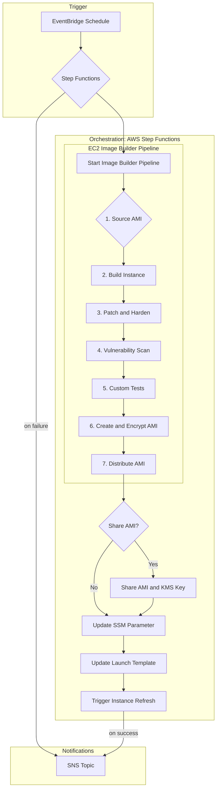

# Automated AMI Update Pipeline

An opinionated, Terraform-driven factory that patches, bakes, distributes, and rolls AMIs into your fleets with AWS-native services (Image Builder, Step Functions, Lambda, EventBridge, SNS, SSM, IAM, KMS). It is built to be reusable across environments via module inputs and automation-friendly scripts.

## Table of Contents
- [Overview](#overview)
- [Terraform Module Usage](#terraform-module-usage)
- [Operations Guide](#operations-guide)
  - [Prerequisites](#prerequisites)
  - [Package the Lambda Artifacts](#package-the-lambda-artifacts)
  - [Configure Environments via tfvars](#configure-environments-via-tfvars)
  - [Manual Deployment Workflow](#manual-deployment-workflow)
  - [Post-deployment Validation](#post-deployment-validation)
  - [Day-2 Operations](#day-2-operations)
  - [Incident Response & Rollback](#incident-response--rollback)
- [Automation Options](#automation-options)
  - [GitHub Actions](#github-actions)
  - [AWS CodeDeploy / CodePipeline](#aws-codedeploy--codepipeline)
- [Security Considerations](#security-considerations)
- [High-Level Design](#high-level-design)
  - [Core Pipeline Stages](#core-pipeline-stages)
  - [Architectural Diagram](#architectural-diagram)
  - [Detailed Stage Breakdown](#detailed-stage-breakdown)

## Overview

The repo is split into two main parts:

- `infrastructure/` contains a reusable Terraform module (`modules/ami-pipeline`) plus a thin root module that wires inputs/outputs and providers.
- `lambda/` contains the Python functions invoked by the Step Functions state machine. Helper scripts under `scripts/` zip these functions and launch Terraform plans/applies.

Use this module-driven approach to deploy separate environments (dev, stage, prod) without duplicating HCL, and to plug the workflow into GitHub Actions or AWS-native automation.

## Terraform Module Usage

The Terraform in `infrastructure/` exposes the module via `module "ami_pipeline" { source = "./modules/ami-pipeline" }`. Each environment is configured purely through variables/tfvars:

1. Copy `terraform.tfvars.example` to a new file (for example `environments/production.tfvars`).
2. Customize required inputs like `source_ami_id`, `notification_email`, `launch_template_ids`, `auto_scaling_group_names`, `consumer_account_ids`, and the cadence (`schedule_expression`).
3. Run from `infrastructure/`:
   ```bash
   terraform init
   terraform plan -var-file=environments/production.tfvars
   terraform apply -var-file=environments/production.tfvars
   ```
4. Optional knobs let you override Lambda package paths, SSM parameter names, Image Builder instance types, tagging, and KMS deletion windows.

Key inputs:

- `name_prefix` and `environment` drive consistent naming so multiple deployments never collide.
- `tags` lets you enforce organizational metadata without editing the module.
- `source_ami_id`, `launch_template_ids`, `auto_scaling_group_names`, and `consumer_account_ids` capture business context for baking and rollout.
- `schedule_expression` governs the EventBridge trigger cadence.

## Operations Guide

### Prerequisites

- Terraform ≥ 1.5 and AWS CLI ≥ 2.9 installed locally or on CI/CD runners.
- IAM principal (user, role, or CI service account) with permissions to create all resources defined in `infrastructure/modules/ami-pipeline` (KMS, SNS, IAM, Lambda, Image Builder, Step Functions, EventBridge, S3, SSM, etc.).
- Secure location for environment tfvars (local disk outside git, GitHub Secrets, or AWS SSM/Secrets Manager).
- Zip utility (needed by `scripts/build_lambdas.sh`).

### Package the Lambda Artifacts

Every `lambda/*.py` file must be zipped before Terraform uploads the functions. Run the helper script whenever code changes:

```bash
bash scripts/build_lambdas.sh
```

It creates `lambda/packages/<function>.zip` artifacts and is idempotent.

### Configure Environments via tfvars

1. Copy `infrastructure/terraform.tfvars.example` to a secure path (e.g., `infrastructure/environments/production.tfvars`).
2. Populate required values (`source_ami_id`, account IDs, emails, target launch templates, ASG names, etc.).
3. (Optional) Override `name_prefix`, `ssm_parameter_name`, Lambda package paths, or `imagebuilder_instance_types`.
4. Store tfvars securely:
   - Local deployments: keep the file outside version control (already ignored via `.gitignore`).
   - GitHub Actions: base64-encode the file and store it as environment secret `TF_VARS_B64`.
   - AWS-native automation: save the plaintext tfvars in an encrypted SSM parameter such as `/ami-pipeline/<deployment-group>/tfvars`.

### Manual Deployment Workflow

From the repo root:

```bash
# Package Lambdas (only needed if not already executed)
bash scripts/build_lambdas.sh

# Deploy with an environment-specific tfvars
bash scripts/deploy.sh -f infrastructure/environments/production.tfvars
```

`scripts/deploy.sh` resolves the tfvars path (or uses `TF_VARS_FILE`), runs `terraform init`, creates a plan with `-var-file`, and applies that saved plan.

### Post-deployment Validation

After `terraform apply` succeeds:

- **SNS subscription:** Confirm the notification email subscription.
- **Image Builder:** Ensure the pipeline exists and that a test execution succeeds (Console → EC2 Image Builder).
- **Step Functions:** Manually kick off the state machine to confirm the Lambda chain.
- **SSM Parameter:** Confirm `/amis/<env>/latest-golden-ami` (or your override) exists and updates succeed.
- **KMS key:** Validate consumer accounts have the grants/policies they need.
- **S3 logs:** Ensure the log bucket (`<prefix>-logs-<account-id>`) is versioned and access controlled.

### Day-2 Operations

- **Rotate source AMIs:** Update `source_ami_id` in tfvars and redeploy; the next scheduled run bakes from it.
- **Add/remove consumer accounts or launch templates:** Modify the tfvars lists and apply.
- **Update Lambdas:** Edit the Python files, rerun `scripts/build_lambdas.sh`, and redeploy (Terraform uses `source_code_hash`).
- **Change schedules:** Adjust `schedule_expression` and apply.
- **Tagging policies:** Use the `tags` map to inject mandatory metadata.

### Incident Response & Rollback

1. **Pipeline failure:** Review Step Functions execution history; SNS failure notifications contain correlation IDs.
2. **Image Builder issues:** Inspect build logs in the S3 log bucket.
3. **Lambda errors:** Check the relevant `/aws/lambda/<function>` CloudWatch Logs groups.
4. **Rollback AMI:** Manually set the SSM parameter to the previous AMI ID and (if needed) rerun the launch template / refresh Lambdas.
5. **KMS/IAM drift:** Re-apply Terraform or inspect live state with `terraform state show`.

## Automation Options

### GitHub Actions

Workflow: `.github/workflows/terraform.yml` (triggered via `workflow_dispatch`). Inputs let you select `plan` or `apply`, the GitHub Environment, and the tfvars filename.

Required GitHub environment secrets:

- `AWS_ROLE_TO_ASSUME`: IAM role ARN trusted for GitHub OIDC (or replace with long-lived keys if necessary).
- `AWS_REGION`: e.g., `us-east-1`.
- `TF_VARS_B64`: base64-encoded tfvars content for that environment.

Workflow steps:

1. Checkout repository.
2. Configure AWS credentials via OIDC.
3. Decode tfvars into `infrastructure/<file>.tfvars`.
4. Run `scripts/build_lambdas.sh`.
5. `terraform init`.
6. `terraform plan` (or `plan + apply` depending on the input).

Extend the workflow with notifications, approvals, or tests as needed.

### AWS CodeDeploy / CodePipeline

Files: `codedeploy/appspec.yml` and `codedeploy/hooks/deploy.sh`.

Recommended topology:

1. **Source stage:** GitHub or CodeCommit source artifact.
2. **Build stage (optional):** CodeBuild for lint/tests.
3. **Deploy stage:** CodeDeploy (EC2/On-Prem) running the provided hook.

How it works:

- CodeDeploy copies the repo to `/opt/ami-pipeline` on the host.
- The hook reads `TF_VARS_FILE` (if preset) or downloads tfvars from SSM (default `/ami-pipeline/<deployment-group>/tfvars`).
- It executes `scripts/deploy.sh`, which packages Lambdas and runs Terraform plan/apply.

Setup steps:

1. Create the SecureString parameter `/ami-pipeline/<deployment-group>/tfvars`.
2. Attach an instance profile to deployment hosts permitting `ssm:GetParameter` on that path and Terraform-managed AWS services.
3. Register hosts in the CodeDeploy deployment group referencing `codedeploy/appspec.yml`.
4. (Optional) Wrap CodeDeploy in a CodePipeline to add approvals or additional stages.

## Security Considerations

- Treat tfvars as sensitive—never commit them; restrict access to secrets/parameters that store them.
- Grant the Terraform execution role least-privilege access and consider separate read (plan) vs write (apply) roles in CI/CD.
- Rotate SNS subscription endpoints, KMS key policies, and IAM roles when account membership changes.
- Enable CloudTrail and AWS Config to audit Terraform-driven changes.
- Monitor Step Functions/Lambda error metrics and add CloudWatch alarms that notify the SNS topic on repeated failures.

## High-Level Design

This section outlines the secure, repeatable workflow for patching AMIs, creating new versions, and rolling them out to your infrastructure.

### Core Pipeline Stages

1. **Scan & Detect (Inspector):** Identify vulnerabilities in the current AMI.
2. **Patch:** Apply necessary security patches and updates.
3. **Bake:** Create a new, hardened "golden" AMI.
4. **Share:** Distribute the new AMI to other AWS accounts.
5. **Update:** Roll out the new AMI to your EC2 instances by updating Launch Templates.

### Architectural Diagram



### Detailed Stage Breakdown

#### 1. Trigger: Kicking off the Pipeline

EventBridge (CloudWatch Events) invokes the Step Functions state machine on a fixed cadence.

#### 2. Orchestration: AWS Step Functions

The state machine orchestrates the entire pipeline, providing retries, error handling, and observability.

#### 3. Scan, Patch, and Bake: The Core AMI Factory

- **Source AMI:** Start from an AWS-managed image or your latest golden AMI stored in SSM.
- **Patching:** EC2 Image Builder leverages SSM Patch Manager runbooks to update the instance.
- **Vulnerability Scanning:** Amazon Inspector runs as a build component; failures halt the pipeline.
- **Baking:** A new encrypted AMI is produced using a customer-managed KMS key.
- **Distribution:** Image Builder copies the AMI to configured Regions.

#### 4. Share: Distributing the Golden Image

- **AMI Permissions:** Lambda updates launch permissions for specific consumer accounts.
- **KMS Key Sharing:** The same Lambda (or supporting logic) ensures the KMS key policy allows those accounts to decrypt.

#### 5. Update: Rolling out the New AMI

- **SSM Parameter Store:** The new AMI ID is written to a well-known parameter (default `/amis/<env>/latest-golden-ami`).
- **Update Launch Templates:** Lambda creates new launch template versions referencing the AMI ID.
- **Instance Refresh:** Lambda triggers Auto Scaling instance refreshes to roll out the AMI with minimal downtime.

This pipeline keeps EC2 fleets aligned with current patches, reduces manual toil, and enforces consistent, auditable workflows across environments.
